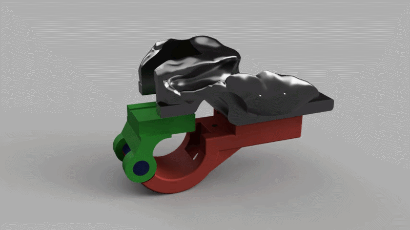

# VeloBrake Assist — ATC-P6

**An open-source assistive cycling device for users with limb differences.**

> Developed at EPFL as part of the Assistive Technology Challenge (ATC) 2025–2026.  
> Team: Camilla Varotto · Hema Gouled · N'zian Koffi · Remy Mühlethaler  

---

## Overview

VeloBrake Assist is a custom-fit braking aid designed for a user with ectrodactyly of the left hand. The device enables safe, independent braking on a standard bicycle. It adapts the open-source [Project Caroline by Macu4]([https://www.macu4.com](https://www.hackahealth.ch/project-caroline-2021)) to the user's specific hand morphology and target bike.

The device consists of three integrated subsystems:

- **Hand-grip** — a custom TPU + PETG mold shaped from the user's hand, providing a secure and comfortable interface between the hand and the handlebar.
- **Braking system** — a stainless steel cable mechanism that transmits the user's wrist/arm downward movement into modulated brake actuation.
- **Attachment mechanism** — a commercial steel pipe clamp designed to fit standardized handlebar (without coatings).

The prototype is functional and has been validated by the user on their own bicycle. Further improvements are planned (see [Future Work](#future-work)).

 
---

## Repository structure

```
ATC-P6-VeloBrakeAssist/
├── docs/
│   ├── user_manual.pdf          # Assembly & use guide (≤3 pages)
│   ├── open_access_report.pdf   # Reproducibility report (≤10 pages)
│   └── final_presentation.pdf  # End-of-semester presentation (EPFL, 29.05.2026)
│
├── worksheets/
│   ├── traceability_matrix_v0.1.xlsx
│   ├── traceability_matrix_v0.2.xlsx
│   ├── traceability_matrix_v0.3.xlsx
│   └── traceability_matrix_v0.4.xlsx
│
├── cad/
│   ├── fusion/                  # Native Fusion 360 source files (.f3d)
│   ├── laser_cut/               # File for Laser cut the MDF piece on the top (.dxf)
│   └── exports/                 # Print-ready files (.stl)
├── media/
│   ├── photos/                  # Prototype photos (design iterations + final)
│   └── videos/                  # Verification & validation footage
│
└── README.md
```

---

## How to reproduce the prototype

Full step-by-step instructions are in [`docs/open_access_report.pdf`](docs/open_access_report.pdf).

Quick summary:

1. **Print the parts** — open the `.stl` files in `cad/exports/`. Recommended settings: PETG at 0.2 mm layer height. 
2. **Route the cable** — thread the stainless steel cable through the channel and crimp the end stops.
3. **Attach to the handlebar** — slide the bracket over the handlebar and tighten the fastening screw.

> **Note:** The hand-grip is user-specific. The current shape was molded from our user's hand using Fimo clay as an intermediate. To reproduce for a different user, reshape the mold in Fusion 360 using the `.f3d` source files in `cad/fusion/`.

---

## Design process

The project followed the **V-model** engineering process:

- **User requirements** (safety, comfort, portability & compatibility) were gathered through home visits and structured interviews.
- **System requirements** were derived: braking system, hand-grip, attachment mechanism.
- **Design & Prototypw**, each subsystem went through design, prototyping, verification (bench tests), and validation (on-bike tests with the user).
- Three iterations of the traceability matrix and risk assessment tracked requirement coverage throughout the semester.

---

## Future work

The current prototype is functional but several improvements are identified for the next iteration:

- Formal mechanical testing (load, fatigue, release force)
- Integrated cable clamp for easier installation
- Metal shaft to improve attachment rigidity
- Compatibility testing on additional bike models

---

## Acknowledgements

Special thanks to our TAs Dounia and Aiden for their guidance throughout this project.  
This project builds on [Project Caroline by Macu4]([https://www.macu4.com](https://www.hackahealth.ch/project-caroline-2021)) — an open-source assistive cycling device.

---

*EPFL · Assistive Technology Challenge 2025–2026 · Group P6*
